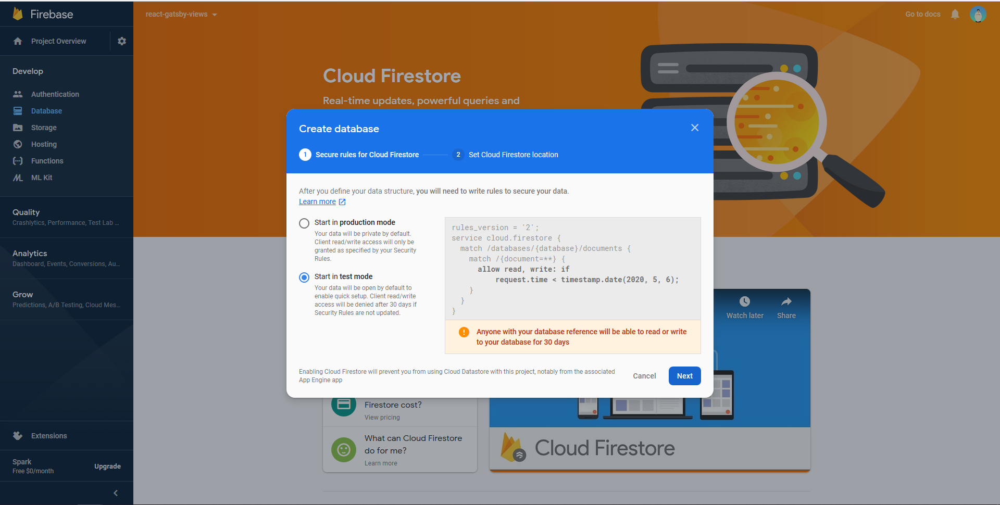
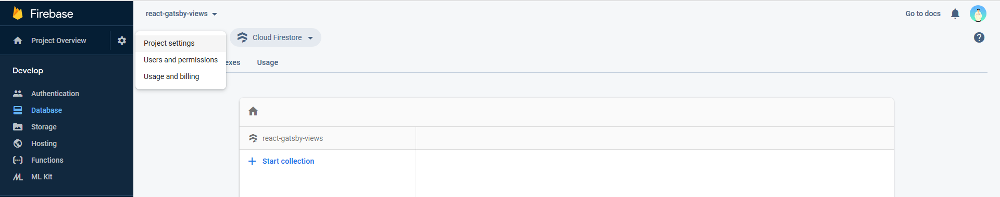
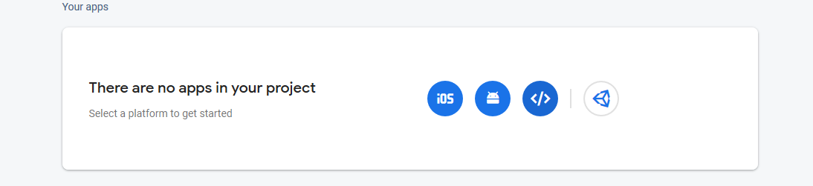
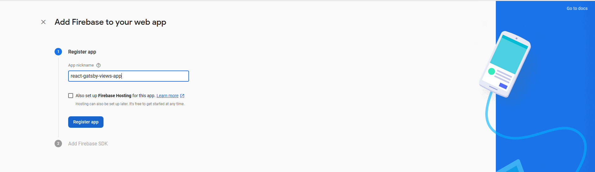
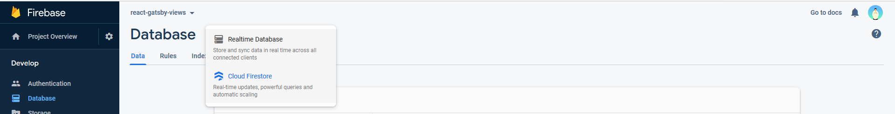
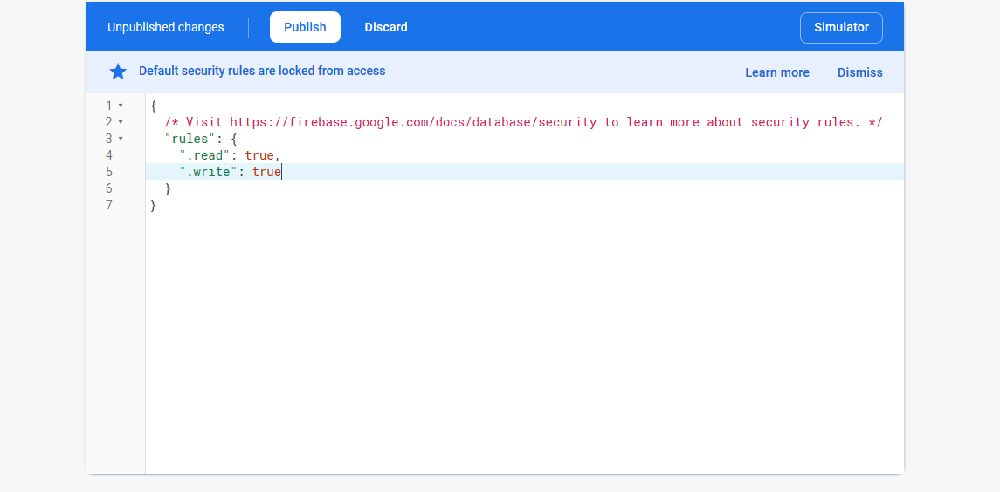
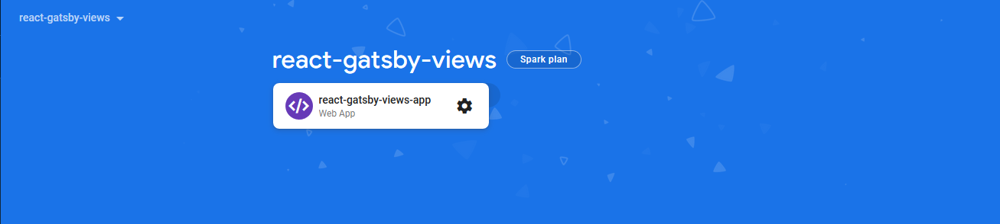
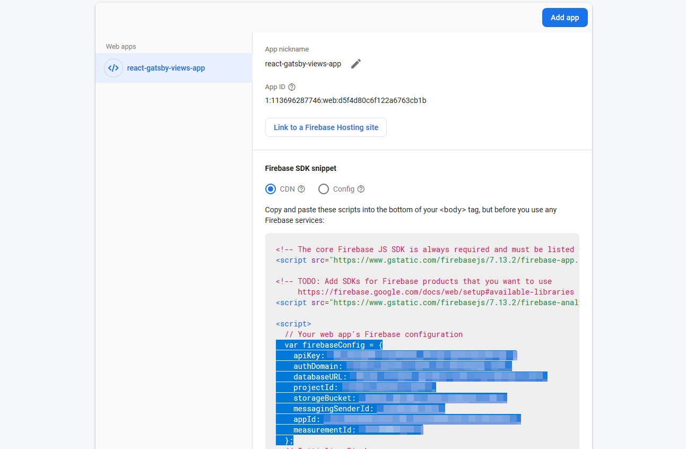
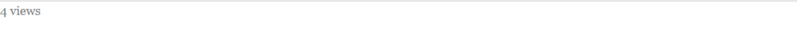
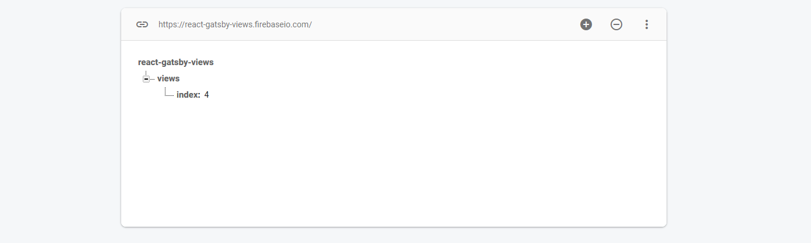

This post is my take on displaying real-time views using Firebase and React. This has previously been done by Guillermo Rauch on [rauchg.com](https://rauchg.com) and Lee Robinson on [leerob.io](https://leerob.io).
Lee also explains how he did this in his [blog](https://leerob.io/blog/real-time-post-views).

So why should you read _my_ post if they have already done so and even explained it? The reason being, both implementations require some sort of node environment to execute code while my post shows how you can achieve it on the _client-side_.

Another reason being, both websites are using [Nextjs](https://nextjs.org/) while mine is using [Gatsbyjs](https://www.gatsbyjs.org/) and I couldn't find anything related to it. So here we are.

<br/>

## Setup

<br/>

### Setting up Firebase

1. Sign in to [Firebase](https://firebase.google.com/) and go to [console](https://console.firebase.google.com/) and create a new project. I'll name mine **react-gatsby-views**. You can enable Google Analytics if you want and click on create project


2. Navigate to Develop -> Database and click on "Create Database"
3. Choose "Start in Test Mode"



4. Choose your location and click on "Done"
5. Click on "Project Settings".



6. Click on web icon to create a "Web App"



7. Enter your name. I'll name mine **react-gatsby-views-app**. Do not enable Firebase hosting and click on "Register app"



8. Click on "Continue to console" as we'll need the config object later


9. Go to "Database" and select "Realtime Database"



10. Go to "Rules" and set `read`, `write` to `true` and click on "Publish" allowing us to update data without sigining in and using the config object



<br/>

### Setting up Gatsby

1. Create a [Gatsby](https://www.gatsbyjs.org/docs/quick-start) project by typing `npx gatsby new enter_project_name` in your terminal.
2. Go inside the created directory and install [gatsby-firebase-plugin](https://www.gatsbyjs.org/packages/gatsby-plugin-firebase/?=firebase) and [firebase](https://www.npmjs.com/package/firebase) by typing `npm install firebase gatsby-plugin-firebase` in your terminal.
3. Register the Gatsby plugin by adding the below lines to your `gatsby-config.js` file

```js
module.exports = {
  plugins: [
    ...otherPlugins,

    {
      resolve: 'gatsby-plugin-firebase',
      options: {
        credentials: {
          apiKey: '<YOUR_FIREBASE_API_KEY>',
          authDomain: '<YOUR_FIREBASE_AUTH_DOMAIN>',
          databaseURL: '<YOUR_FIREBASE_DATABASE_URL>',
          projectId: '<YOUR_FIREBASE_PROJECT_ID>',
          storageBucket: '<YOUR_FIREBASE_STORAGE_BUCKET>',
          messagingSenderId: '<YOUR_FIREBASE_MESSAGING_SENDER_ID>',
          appId: '<YOUR_FIREBASE_APP_ID>',
        },
      },
    },
  ],
};
```

you can refer the documentation [here](https://www.gatsbyjs.org/packages/gatsby-plugin-firebase/?=firebase).

4. Since we are using Realtime Database, add `import "firebase/database"` to `gatsby-browser.js` and `gatsby-ssr.js` files.

```js
// gatsby-browser.js and gatsby-ssr.js
import 'firebase/database';
```

<br/>

### Integration

1. Go to your Firebase console and select your web app.



2. Scroll down to Your apps and and copy the `firebaseConfig` object.



3. Create an `.env` file at the root of your project and paste the content like so

```
API_KEY='your_values_here'
AUTH_DOMAIN='your_values_here'
DATABASE_URL='your_values_here'
PROJECT_ID='your_values_here'
STORAGE_BUCKET='your_values_here'
MESSAGING_SENDER_ID='your_values_here'
APP_ID='your_values_here'
MEASUREMENT_ID='your_values_here'
```

4. Edit the `gatsby-config.js` file to consume the environment variables

```js
    {
      resolve: 'gatsby-plugin-firebase',
      options: {
        credentials: {
          apiKey: process.env.API_KEY,
          authDomain: process.env.AUTH_DOMAIN,
          databaseURL: process.env.DATABASE_URL,
          projectId: process.env.PROJECT_ID,
          storageBucket: process.env.STORAGE_BUCKET,
          messagingSenderId: process.env.MESSAGING_SENDER_ID,
          appId: process.env.APP_ID,
        },
      },
    },
```

5. Install [env-cmd](https://npmjs.org/package/env-cmd) as a dev dependency to use the environment variables by typing `npm i -D env-cmd`
6. Modify "develop" command in `package.json` to `env-cmd -f .env gatsby develop`
7. Add the below code to `gatsby-config.js`

```js
require("dotenv").config({
  path: `.env.${process.env.NODE_ENV}`,
})
module.exports = {
  ...
}
```

<br/>

### Implementation

1. Go to `src/pages/` and remove the unnecessary content with a simple one

```js
// index.js
import React from 'react';
import ViewCounter from '../components/ViewCounter';

const Index = () => (
  <div>
    <ViewCounter id="index" />
  </div>
);

export default Index;
```

2.  Don't worry if you get an error


we'll create the `ViewCounter` component in just a minute.

3.  Create directory `lib` under `src` and a file named `increment-views.js` in it. It should look like this

```
src
 |-lib
    |-increment-views.js
```

4. Copy the below code into the file

```js
// increment-views.js
import firebase from 'gatsby-plugin-firebase';

const incrementViews = async (id) => {
  const ref = firebase.database().ref(`/views`).child(id);

  ref.transaction((currentViews) => {
    return currentViews + 1;
  });
};

export default incrementViews;
```

This basically creates a reference of database at `/views` and creates an entry of `id` under views. Different ids will create additional entries and will update the view whenever the function is called.

`ref.transaction()` is used to modify the data at the location. In our case `views` of `id` are incremented.

5. Create a file `ViewCounter.js` under `src/components/` and copy the below code

```js
// ViewCounter.js
import React, { useEffect, useState } from 'react';
import firebase from 'gatsby-plugin-firebase';
import incrementViews from '../lib/increment-views';

const ViewCounter = ({ id }) => {
  const [viewCount, setViewCount] = useState('');

  useEffect(() => {
    // 1 is displayed for a split second and then the correct count
    // This is a workaround
    const onViews = (newViews) => {
      setViewCount(newViews.val() === 1 ? 0 : newViews.val());
    };

    incrementViews(id);

    firebase.database().ref(`/views`).child(id).on(`value`, onViews);

    return () => {
      if (firebase.database()) {
        firebase.database().ref(`/views`).child(id).off(`value`, onViews);
      }
    };
  }, [id]);

  return (
    <div style={{ color: '#7e7e7e' }}>
      {viewCount ? viewCount : `---`} views
    </div>
  );
};

export default ViewCounter;
```

On loading this component, `id` is sent to `increment-views` to increment the value and the returned value is stored in `viewCount`.

Upon completion, if an instance of database exists, detach it using `off()`

6. Now everytime you refresh the page or anyone visits it, view count will be incremented.

App Views



Firebase Views



### Deployment

Since I have deployed my site on [Zeit](https://zeit.co/), it uses [now secrets](https://zeit.co/docs/v2/build-step#adding-secrets). Each host provider has a different mechanism to handle environment variables.

I hope you've liked this post. Any suggestions, improvements are welcome.

<br/>

### You can view the complete project on [GitHub](https://github.com/FlashBlaze/gatsby-firebase-realtime-views)
