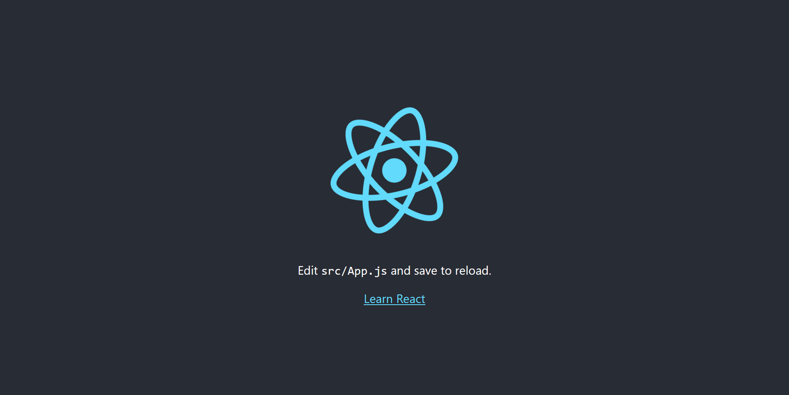
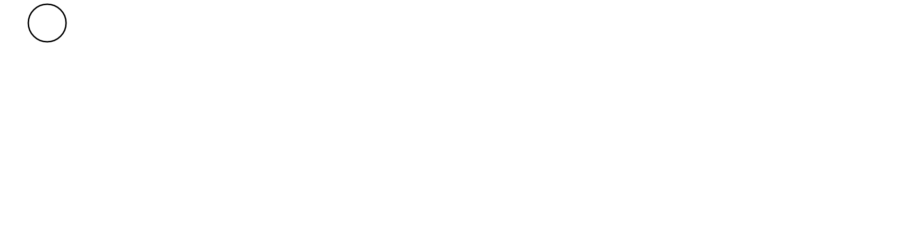

import ReactPlayer from 'react-player';
import BasicAnim from './assets/svg-animations-react-spring/4_circle_basic_animation.mp4';
import AdvancedAnim from './assets/svg-animations-react-spring/5_circle_advanced_animation.mp4';

# Introduction

Animations are an important part of a website, and when implemented correctly, they deliver a good user experience.
Although there are some animation libraries which work with React, we are going to take a look at [react-spring](https://www.react-spring.io/) a great animation library which is based on physics (yes you read that right) instead of durations.

The need for this post arose when I tried to animate an svg using _react-spring_ but I could not find a good resource from start to finish. Although _react-spring_ documents on [animating an svg](https://www.react-spring.io/docs/props/spring), implementing it as is will not work as a number of parameters required such as svg path length, stroke dash array, etc are not mentioned.

So, let us begin!

# Setup

1. Begin by typing

```
npx create-react-app react-spring-demo
```

in your terminal. Go inside the created project and install react-spring by typing `npm install --save react-spring`

2. Type

```
npm run start
```

in terminal to start the React app.

Go to `http://localhost:3000` to view the running app.



Go to `src` directory and create a new file `Animation.js` which will contain the animation code.

3. Remove everything from `App.js` and import `Animation.js`. Inside `Animation.js` type a simple hello world program as a placeholder.

Below is `App.js`

```js
// App.js
import React from 'react';
import Animation from './Animation';

const App = () => {
  return (
    <div>
      <Animation />
    </div>
  );
};

export default App;
```

Below is `Animation.js`

```js
//Animation.js
import React from 'react';

const Animation = () => {
  return <h1>Hello World!</h1>;
};

export default Animation;
```


# Animation

Replace the code in `Animation.js` by the following code

```js
// Animation.js
import React, { useEffect, useRef } from 'react';

const Animation = () => {
  const pathRef = useRef();

  useEffect(() => {
    console.log(pathRef.current.getTotalLength());
  }, []);

  return (
    <div>
      <svg>
        <circle
          strokeWidth="3"
          cx="100"
          cy="50"
          r="40"
          stroke="black"
          fill="none"
          ref={pathRef}
        />
      </svg>
    </div>
  );
};

export default Animation;
```



To animate an svg, you need the path length of it. [css-tricks](https://css-tricks.com/svg-line-animation-works/) explains on how to achieve this using HTML, CSS and vanilla JavaScript which I translated to React.

To get the path length, you'll need a reference to the path which is achieved through `useRef` hook which is used to reference the DOM or React element. `getTotalLength()` gives us the total length.

`useEffect` hook is used to get the length of the svg path as soon as the component is mounted.

You can either note down the length from browser console and then use it in `useState` **or** you can render an invisible svg temporarily and render the final svg on setting the `offset` value. I'm going to follow second method as I won't have to constantly check `console.log()` whenever I change the svg.

## Move the shape already!

Yeah yeah. Now the fun part of animating the circle

Copy the following code in `Animation.js`

```js
// Animation.js
import React, { useEffect, useState, useRef } from 'react';
import { Spring } from 'react-spring/renderprops';

const Animation = () => {
  const pathRef = useRef();
  const [offset, setOffset] = useState(null);

  useEffect(() => {
    setOffset(pathRef.current.getTotalLength());
  }, [offset]);

  return (
    <div>
      {offset ? (
        <Spring from={{ x: offset }} to={{ x: 0 }}>
          {(props) => (
            <svg>
              <circle
                strokeDashoffset={props.x}
                strokeDasharray={offset}
                strokeWidth="3"
                cx="100"
                cy="50"
                r="40"
                stroke="black"
                fill="none"
                ref={pathRef}
              />
            </svg>
          )}
        </Spring>
      ) : (
        <svg>
          <circle
            strokeWidth="3"
            cx="100"
            cy="50"
            r="40"
            stroke="none"
            fill="none"
            ref={pathRef}
          />
        </svg>
      )}
    </div>
  );
};

export default Animation;
```

<ReactPlayer url={BasicAnim} controls={true} width="100%" />

To create the animation of circle being completed from length 0 to full length, we need its length which is stored in offset.

Initially, when the component is loaded the `offset` value is null. To get the length, we need the svg. As we do not need to display it, stroke is set to none. As soon as `offset` value is set, we display the svg and animate it.

`Spring` renderprop is used to move data from one state to another. `strokeDasharray`defines the length of dashes to display in our svg. Since we want the complete circle, its value should be the length of the circle i.e. `offset`.

`strokeDashoffset` sets the offset value which moves the position of the dashes. Now we animate it from its `offset` value to 0 so it looks like the circle is being drawn.

You can also configure various parameters like `friction`, `tension`, `precision`, etc. The complete list can be found [here](https://www.react-spring.io/docs/props/spring)

This is the modified code which shows what changing some values does

```js
// Animation.js
import React, { useEffect, useState, useRef } from 'react';
import { Spring } from 'react-spring/renderprops';

const Animation = () => {
  const pathRef = useRef();
  const [offset, setOffset] = useState(null);

  useEffect(() => {
    setOffset(pathRef.current.getTotalLength());
  }, [offset]);

  return (
    <div>
      {offset ? (
        <Spring
          from={{ x: offset }}
          to={{ x: 0 }}
          config={{ tension: 4, friction: 0.5, precision: 0.1 }}
        >
          {(props) => (
            <svg>
              <circle
                strokeDashoffset={props.x}
                strokeDasharray={offset}
                strokeWidth="3"
                cx="100"
                cy="50"
                r="40"
                stroke="black"
                fill="none"
                ref={pathRef}
              />
            </svg>
          )}
        </Spring>
      ) : (
        <svg>
          <circle
            strokeWidth="3"
            cx="100"
            cy="50"
            r="40"
            stroke="none"
            fill="none"
            ref={pathRef}
          />
        </svg>
      )}
    </div>
  );
};

export default Animation;
```

<ReactPlayer url={AdvancedAnim} controls={true} width="100%" />

# Conclusion

[react-spring](https://www.react-spring.io/) is an amazing animation library which is based on physics and gives amazing results based on actual physical properties. You can similarly animate opacity, change colours, etc. and have a blast with it.

### You can view the complete project on [GitHub](https://github.com/flashblaze/react-spring-animation-demo)
